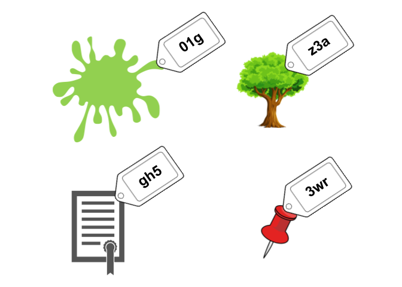

# 2. Claves y valores

Índice:

- [Desarrollo](2_claves_y_valores.md#desarrollo)
- [Ejercicios](2_claves_y_valores.md#ejercicios)
	- [git hash-object](2_claves_y_valores.md#git-hash-object)
- [Para recordar](2_claves_y_valores.md#para-recordar)
- [Otros recursos](2_claves_y_valores.md#recursos)


----


## Desarrollo

 > _Claves y valores, una pareja inseparable_.
 
 

El núcleo de git está conformado por un almacén de claves y valores.

- Sinónimos de "clave"
	- key
	- SHA-1
	- Identificador o ID

- Sinónimos de "valor"
	- value 
	- objeto
	

Para fines de este capítulo diremos que **_Git es un almacén de pares conformados por un objeto de Git y su respectivo identificador llamado SHA-1_**. 

Git consta de varios tipos de objetos, cada objeto sirve para realizar distintas acciones que ayudarán a rastrear el contenido de nuestro repositorio.

El SHA-1 es un identificador único que Git da a cada uno de los objetos que se vayan creando a lo largo del desarrollo de un repositorio. El SHA-1 consta de 40 caracteres.

Ejemplos de objetos con su identificador SHA-1:

| OBJETO | SHA-1* |
| ---- | ---- |
| Mancha verde | 01g |
| Árbol frondoso| z3a |
| Certificado | gh5 |
| Chincheta roja | 3wr 


 


*_Por fines ilustrativos se redujo a tres el número de caracteres del SHA-1_

## Ejercicios
----

Comencemos a utilizar nuestro primer comando de bajo nivel.

### git hash-object

Modificadores comunes:

	--stdin : lee el objeto desde el "standard input".
	
	-w : escribe el contenido en el repositorio; "w" hace referencia a "write".
 
 `git hash-object` es como una máquina generadora de tickets, cuando lo ejecutamos nos devuelve un identificador (SHA-1).
 
  
 
 Es importante notar que `git hash-object` sólo asigna un SHA-1 a un objeto, así que, si no tienes un objeto creemos uno:
 
```bash 
# esto nos devuelve el texto entre comillas:
$ echo "hola"
hola

# con el pipe (|) mandamos "por un tubo" el texto hacia `git hash-object` para que lo convierta en un objeto y le asigne un SHA-1.
# deberías obtener un resultado similar a siguiente (lo más probable es que el SHA-1 que te asigne Git sea diferente pero debe tener 40 caracteres)
$ echo "hola" | git hash-object  --stdin
5c1b14949828006ed75a3e8858957f86a2f7e2eb

# ejecuta el comando anterior varias veces y verás que te sigue devolviendo el mismo SHA-1.

# haz ligeras modificaciones al contenido y verás que obtienes distintos SHA-1 por más ligera que sea la modificación que hagas:

$ echo "hola mundo" | git hash-object --stdin
24db42bb7b999597a72801da70efd5876059bc0b

echo "hola mundo    " | git hash-object --stdin
3e174261f5bb6af3946be7a8a7c36ad7b6accfed

echo "hola mundo!" | git hash-object --stdin
8087ff8cab9a2eeeedb63ff7ad08e63bdd121ed4

echo "hola mundo." | git hash-object --stdin
b81c3656d92412d0b2841ead224cdbb53084b656

echo "hola mundo hola mundo" | git hash-object --stdin
2b274cfb2a0a289ccafa5fb56a64e2540fd63090

# confirma que el hash que te sigue devolviendo para el contenido "hola" sigue siendo el mismo:
$ echo "hola" | git hash-object --stdin
5c1b14949828006ed75a3e8858957f86a2f7e2eb

```

## Para recordar
---
> - Si modificamos ligeramente el contenido y ejecutamos `git hash-object` obtendremos un objeto y su SHA-1 completamente nuevos.
Recuerda que en el núcleo Git trabaja con pares "SHA-1" + "objeto", por tanto, un SHA-1 nuevo indica objeto un nuevo.

> - Si introducimos exactamente el mismo contenido, obtendremos el mismo SHA-1 al ejecutar  `git hash-object`.


