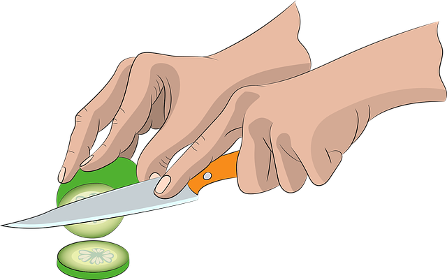
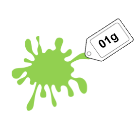

# 3. Los objetos de Git

Índice:

- [Desarrollo](3_los_objetos_de_git.md#desarrollo)
- [Ejercicios]()
	-  
- [Conclusiones]()
- [Otros recursos]()

## Desarrollo
Git está "equipado" con cuatro objetos para "explorar": blob, tree, commit y tag.

### Blob (binary large object)

Antes de dar la definición tratemos de listar las partes de un archivo.

- Un archivo puede tener:
	- nombre 
	- contenido
	- dirección de almacenamiento
 
 Sin embargo, Git "separa" el contenido del nombre y dirección de almacenamiento. 
 
 
 
- Un Blob es un objeto que contiene el contenido de un archivo. 
- Un Blob NO contine el nombre del archivo ni la dirección de almacenamiento del archivo.
 
En este curso representaremos un Blob con la siguiente imagen:
 

### Tree

Un Tree(árbol) es un objecto se conecta hacia los Blobs. Es importante notar que para ir de un Tree a un Blob quizás sea necesario pasar por otros Trees.
### Commit

### Tag

